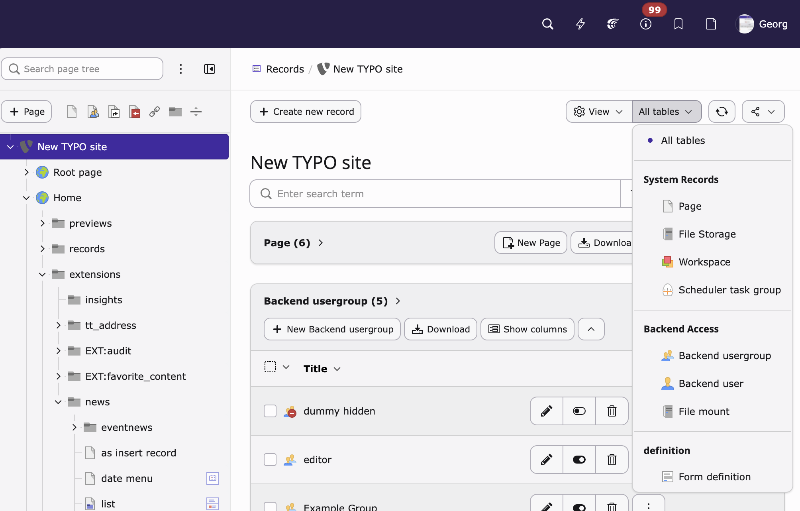

# Record Type Selection

Adds a grouped table filter dropdown to the TYPO3 backend list module (Content > Record).

## What it does

When viewing a page in the records module, a "Tables" dropdown appears in the doc header. It shows only tables that actually have records on the current page, grouped by extension. Selecting a table switches to single-table view for that page.



## Requirements

- TYPO3 14.x
- PHP 8.4+

## Installation

```bash
composer require georgringer/record-type-selection
```
